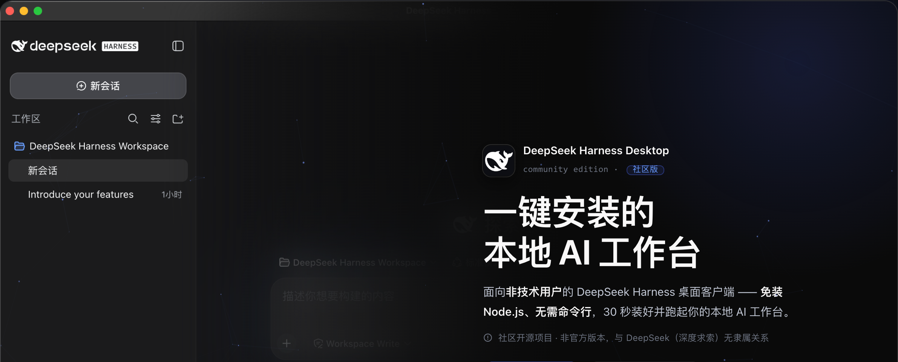

# DeepSeek Harness Desktop

English | [中文](./README.zh.md)



A one-click installer + desktop client for **DeepSeek Harness**, built for non-technical users.

> Goal: let people with no technical background install and use DeepSeek Harness in
> 30 seconds — no Node.js, no command line, and no need to understand concepts like
> "service" or "port".

**Repository**: [github.com/yansenlei/dsh-desktop](https://github.com/yansenlei/dsh-desktop)

**Download**:
- 🖥️ **Download page (recommended)**: [yansenlei.github.io/dsh-desktop](https://yansenlei.github.io/dsh-desktop/) — auto-detects your OS, distinguishes Apple Silicon / Intel on macOS, and includes install instructions and FAQ
- 📦 **GitHub Releases**: [latest](https://github.com/yansenlei/dsh-desktop/releases/latest) (the in-app "Settings → Check for updates" uses this as its update source; the link always points to the newest release, so no version numbers to maintain)

## Built-in plugins: two ways to control your PC from your phone

- 📱 **QR over LAN (lan-access)**: **at home** — connect your phone to the same Wi-Fi, scan a QR code, and control your computer.
- 📱 **QR Telegram (telegram-bridge)**: **when you're away** — chat with a bot in your own Telegram to control your computer anytime.

Plugin source code is open and can also be installed into any DSH environment: `npx dsh-plugin-lan-access` / `npx dsh-plugin-telegram-bridge` (see [dsh-plugin-lan-access](https://github.com/yansenlei/dsh-plugin-lan-access) / [dsh-plugin-telegram-bridge](https://github.com/yansenlei/dsh-plugin-telegram-bridge)).

## Features

- **One-click install**: NSIS installer — double-click → install → auto-launch. Desktop/Start-menu shortcuts and a full uninstaller included.
- **No Node.js required**: the app bundles Electron (with a Node 24 runtime); the DSH service runs as a child process inside the app. Nothing needs to be installed on your machine.
- **Bundled DSH runtime**: the DSH engine (`@deepseek-ai/dsh`) and all of its dependencies ship with the installer and work offline (engine version follows the release; check it in the Settings → About page).
- **Desktop shell experience**: dark tech-style branded boot page (spinning halo logo + boot progress + live logs) → auto-loads the Harness workspace; system tray resident (status, open/restart/settings/quit).
- **📱 QR over LAN (at home)**: built-in `lan-access` plugin. Connect your phone to the same home/office Wi-Fi, scan the QR in the Harness sidebar ("LAN"), and open your workspace on the phone — get AI work done from the couch. One-click toggle in Desktop Settings → LAN Access (off by default, local-only; see the security note below).
- **📱 Telegram remote (on the go)**: built-in `telegram-bridge` plugin. Add a bot in your own Telegram (scan-to-connect), then message it anytime to have AI operate your computer — even when you're not in front of it. Shares the same session as the browser workspace, with synced history.
- **Optional environment one-click setup**: auto-detect and one-click install of Python (winget first, official installer fallback) and the `dsh` CLI (auto-installs Node LTS + global dsh).
- **Self-contained data**: sessions, config and storage live in the app data directory — uninstalling never deletes them; port conflicts auto-roll to the next free port.
- **Cross-platform**: Windows (NSIS installer) and macOS (dmg/zip, x64 + Apple Silicon) are both supported; see `docs/BUILD_MAC.md` for macOS builds.
- **i18n**: shell UI and main-process strings support Chinese/English, switchable in Settings.
- **Reliability**: automatic restart on service crash (with backoff), startup timeout detection, log rotation, single-instance lock, window-state memory.

## Architecture

```
┌────────────────────── Electron 41（Chromium 146 + Node 24）─────────────┐
│  main process                                                            │
│  ├─ window/tray/lifecycle ── shell UI（local HTML: boot / settings）     │
│  ├─ IPC bridge（contextBridge, sandboxed renderer）                      │
│  └─ DshServerManager: spawns the dsh web child process (ELECTRON_RUN_AS_NODE) │
│        ├─ port probing (default 3080, rolls forward when busy)          │
│        ├─ health polling (HTTP 200 → ready)                             │
│        ├─ crash auto-restart (≤3 times, 2s backoff)                     │
│        └─ LAN access: generates a patch (host=0.0.0.0) + plugin junction │
├─ resources/dsh-runtime/: @deepseek-ai/dsh + deps + lan-access plugin     │
├─ built-in plugin @dsh-desktop/lan-access (LAN QR code)                   │
│    ├─ node half: registers /lan-info (LAN IP/URL/enabled status)         │
│    └─ client half: sidebar "LAN" button + QR panel (bundled qrcode)      │
└─ child process: dsh web（Node 24 · DSH_HOME=userData/dsh-home · dynamic port）│
        └─ http://127.0.0.1:<port> → BrowserWindow loads the Harness UI    │
```

- **Service/shell isolation**: the Harness service is a separate child process — a crash never takes down the app shell, and it can be restarted at any time.
- **No external dependency to launch**: Electron's built-in Node 24 satisfies the DSH requirements (zstd / type-stripping).
- **LAN access mechanism**: when enabled, a `--patch` binds the webserver to `0.0.0.0`;
  DSH's `resolveLanTrust` automatically adds the machine's LAN IPv4 to the browser-trust allowlist,
  so phones and other LAN devices can connect. The plugin is injected via a junction link under
  `$DSH_HOME/profiles/web/node_modules` (the loader resolves modules from the profile directory).
- **Python / dsh CLI are optional**: one-click install only when the user needs them; never blocks the main flow.

## Directory layout

```
dsh-desktop/
├── src/
│   ├── main/          # Electron main process (index/server/deps/ipc/settings/logger)
│   ├── preload/       # contextBridge
│   ├── renderer/      # shell UI (boot page / settings page + i18n)
│   └── shared/        # types & constants shared between main and renderer
├── runtime/           # DSH runtime (node_modules installed by prepare-runtime)
├── scripts/           # build (esbuild) / prepare-runtime / make-icon / smoke
├── build/             # generated app icons (icon.ico/icon.png/tray.png)
└── docs/              # user guide, FAQ
```

## Local development

Requirements: Windows 10+, Node 22 (build only — the shipped product needs none).

```bash
npm install                      # installs electron/electron-builder/esbuild etc.
npm run prepare:runtime          # installs and trims the DSH runtime into runtime/
npm run build                    # esbuild bundles main/preload/renderer into dist/
npm run smoke                    # end-to-end smoke test (start service → HTTP probe → exit)
npm start                        # run locally (builds then launches Electron)
npm run dist                     # package the NSIS one-click installer (release/ dir)
npm run check:upstream           # checks runtime dsh against the npm latest (maintainer)
```

> If GitHub is unreachable during builds (Electron/NSIS toolchain downloads), set a mirror:
> ```powershell
> $env:ELECTRON_BUILDER_BINARIES_MIRROR="https://npmmirror.com/mirrors/electron-builder-binaries/"
> ```

### Smoke test

`npm run smoke` launches the app headlessly and verifies: DSH service starts → HTTP 200 →
`window.__DSH_BOOT__` injected → clean exit. Results are written to `smoke-result.json`.

### CI build & release

`.github/workflows/build-release.yml` provides the GitHub Actions pipeline:
- push to `main`: builds Windows / macOS installers and uploads artifacts
- `v*` tag: automatically publishes a GitHub Release (the in-app "Check for updates" source)

## Installer artifacts

- `release/DeepSeek-Harness-Desktop-Setup-<version>.exe` — NSIS one-click installer (~130MB, full DSH runtime + Electron)
  - Installs to `%LOCALAPPDATA%\Programs\dsh-desktop\`, creates desktop/Start-menu shortcuts, auto-launches after install
- `release/win-unpacked/` — portable build (run `DeepSeek Harness Desktop.exe` directly)
- Uninstall via Windows "Apps & features" or `Uninstall DeepSeek Harness Desktop.exe`; uninstalling **does not delete** user data (`%APPDATA%\DeepSeek Harness Desktop`)

### Verified end-to-end flow (tested locally)

| Step | Result |
|---|---|
| Build | esbuild bundles main/preload/renderer + lan-access plugin ✔ |
| Smoke test (headless) | DSH service ready in 4-8s, HTTP 200, `__DSH_BOOT__` injected, clean exit ✔ |
| Built-in plugin | `/lan-info` route + `__DSH_BOOT__` injection + `/plugins/@dsh-desktop/lan-access/client.js` loadable ✔ |
| LAN access | `http://<LAN-IP>:<port>` returns HTTP 200 after enabling (browser-trust auto-allow) ✔ |
| Packaging | electron-builder produces the NSIS installer ✔ |
| Silent install | installs, registers uninstall entry, creates shortcuts ✔ |
| Normal GUI launch | main window loads the Harness UI; tray works ✔ |
| Port conflict | auto-rolls when 3080 is busy ✔ |
| Graceful exit | service child process stops cleanly ✔ |

## LAN access security notes

"Settings → LAN Access" is **off** by default (the service listens on 127.0.0.1 only). When enabled:
- The service listens on `0.0.0.0` — **any device on the same LAN** can reach it (no login auth; only browser-trust source checks).
- Only enable it on trusted networks (home/office Wi-Fi); never on public Wi-Fi.
- Turn it off and restart the service to restore local-only access.

## Known limitations (v0.2)

- **No official Apple signing/notarization** (builds since v0.2.4 carry an **ad-hoc signature**, no terminal needed to open):
  - Windows: SmartScreen shows "Unknown publisher" — choose "More info → Run anyway".
  - macOS: the first open of a downloaded, un-notarized app shows "cannot verify the developer" — click **"Open"** (or right-click the app → Open); once only, no terminal needed. Later "Check for updates → Download & install" replaces the app automatically and clears quarantine, fully seamless.
  - ⚠️ If an old version (v0.2.3 or earlier) says "damaged, cannot be opened": that's stale invalid signing left in old packages — use v0.2.4 or newer; or temporarily run `codesign --force --sign - "/Applications/DeepSeek Harness Desktop.app"` in a terminal, then right-click → Open.
  - For official distribution, configure an Apple Developer certificate + notarization (zero clicks for users; see `docs/BUILD_MAC.md`).
- Updates use a "check + auto-install" model: the settings page queries GitHub Releases for the latest version and offers "Download & install":
  - **Windows**: streaming NSIS download (with progress) → `/S` silent install → app exits and the installer relaunches the new version.
  - **macOS**: streaming download of the matching-arch zip (with progress) → app exits → unzip & replace `.app` (quarantine removed, so unsigned builds keep opening) → auto-restart.
- **macOS is released** (since v0.2.0, dmg/zip × x64/arm64), auto-update parity with Windows.
- Linux targets are not packaged yet (no linux config in `package.json`; can be added as needed).

## License

MIT. DeepSeek Harness itself follows its upstream license (MIT).
